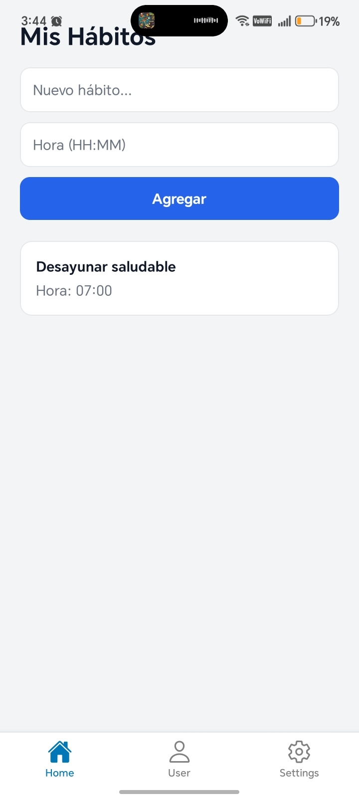
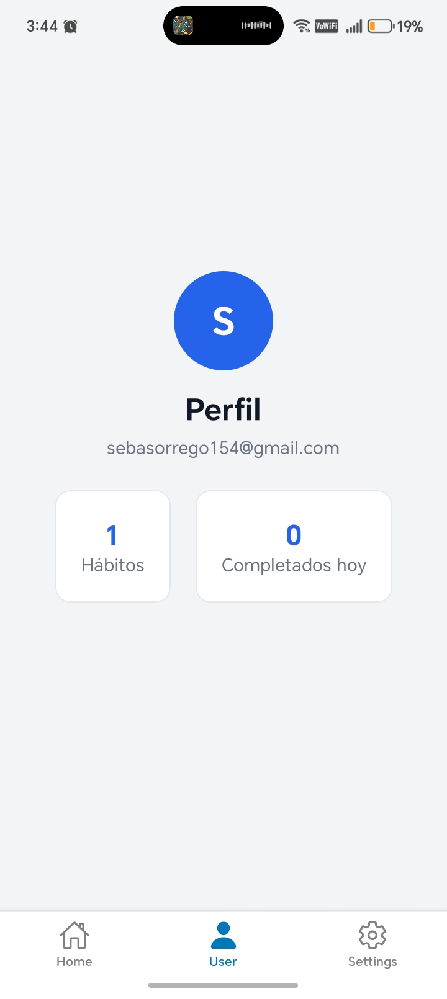
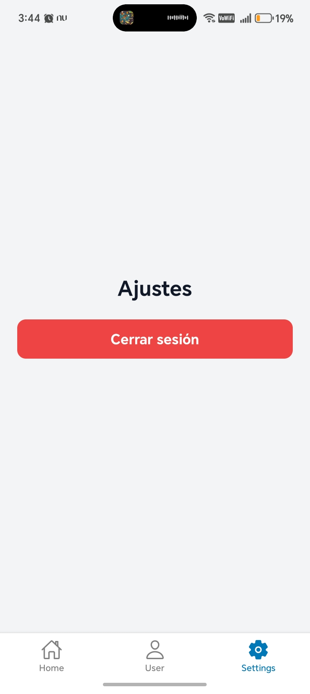

# Better Habits

Aplicación móvil desarrollada con React Native y Expo enfocada en ayudar a los usuarios a mejorar sus hábitos diarios mediante el seguimiento y control de sus actividades.

---

## Descripción

Better Habits es una app de productividad personal donde los usuarios pueden crear hábitos, marcar su progreso diario y llevar un control básico de su constancia.

La aplicación incluye autenticación con Firebase y permite personalizar el perfil del usuario.

---

## Funcionalidades actuales

- Registro de usuarios  
- Inicio de sesión con Firebase Authentication  
- Creación y gestión de hábitos  
- Seguimiento de hábitos completados  
- Perfil de usuario  
- Subida de foto de perfil con Cloudinary  

---

## Tecnologías utilizadas

- React Native  
- Expo  
- Firebase (Authentication y Firestore)  
- Cloudinary  

---

## Evidencias de funcionamiento

### Registro de usuario
Permite crear una cuenta con correo, nombre y contraseña  

---

### Inicio de sesión
Permite ingresar a la aplicación con credenciales registradas  

---

### Vista principal (Home)
Pantalla donde se gestionan los hábitos

---

### Perfil de usuario
Pantalla con el perfil del usuario 

---

### Cierre de sesión
Vista relacionada con el logout  

